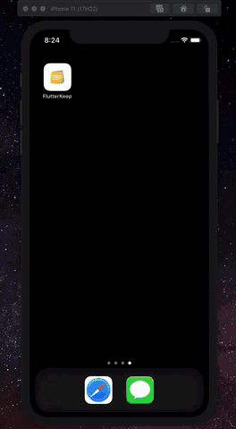

# FlutterKeep

App em Flutter para entrega da "P2" do curso "Tópicos avançados em programação", Faculdade Einstein Limeira.

### Breve descritivo

Na discussão do tema do projeto, encontramos algumas ideias, e a escolhida foi fazer um clone simples do Google Keep - um aplicativo para criar notas.
É um aplicativo simples, intuitivo e que conseguiríamos utilizar vários conceitos de Dart e Flutter.

Usamos o pacote "provider" para o gerenciamento de estado. O que direcionou para que pudéssemos utilizar o padrão Data Driven Pattern, escrevendo o código de modo reativo.

Além disso Firebase e Firestore para armazenamento dos dados, autenticando os usuários e gerenciando as notas criadas.
Também possibilita a funcionalidade de se autenticar usando uma conta do Google, aproveitamos isso e implementamos no projeto.

As principais telas:
- Tela de autenticação, garantindo que apenas usuários autenticados possam criar as notas;
- Tela inicial, exibindo a lista de notas;
- Tela de criação/edição de notas.

No aplicativo, depois de autenticado, o usuário consegue criar, editar, arquivar e excluir notas; além de fixar as notas que considerar mais importantes.
Tudo de maneira bem simples e direta, como o app que usamos de inspiração para este projeto.
As notas são simples, apenas com título e texto.
Tivemos algumas dificuldades para implementar outras mídias e tipos de nota, só que pelo prazo, achamos melhor deixar de fora, de modo não que prejudicasse a entrega e conseguindo manter a proposta original do projeto.

O aplicativo foi muito bem testado no iPhone 11 (iOS Simulator) e Android (Pixel 3a API 30 x86).

### Demo

